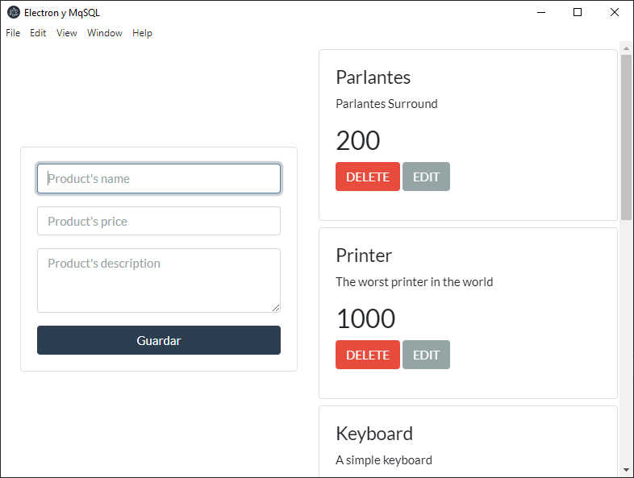

# CRUD de productos hecho con electron y mysql

Paquetes usados:

* [electron](https://www.electronjs.org/): Framework de Node para hacer aplicaciones de escritorio
* [electron-reload](https://www.npmjs.com/package/electron-reload): Paquete para auto-reiniciar electron ante cambios
* [promise-mysql](https://www.npmjs.com/package/promise-mysql): Conector de mysql de Node que trabaja con promesas
* [dotenv](https://www.npmjs.com/package/dotenv): Paquete para cargar variables de entorno

Si quieres usar este proyecto:

* Clona este repositorio
* En un server de MySQL ejecuta los scripts del archivo ***database.sql***
* Instala las dependencias necesarias en el proyecto: `npm install`
* Copia el contenido de ***.env.example*** en un archivo ***.env*** y rellena los datos con las credenciales de tu servidor
* Inicia el proyecto: `npm start`
* Empieza a desarrollar